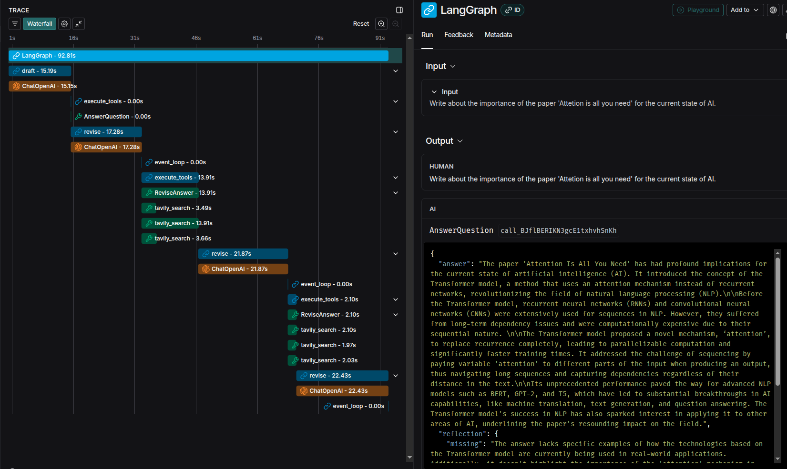

# Reflexion Agent

This repository is part of the [LangGraph: Build Advanced LLM Agents with LangChain](https://www.udemy.com/course/langgraph/) Udemy course.  
It demonstrates how to build an iterative, tool-using AI agent workflow using [LangChain](https://python.langchain.com/) and [LangGraph](https://github.com/langchain-ai/langgraph).

## Features

- **Graph-based agent workflow**: Modular, iterative reasoning using LangGraph.
- **Tool integration**: Uses web search (Tavily) to enhance answers.
- **Iterative refinement**: The agent drafts, searches, and revises answers in a loop.

## Environment Setup

To run this project, we recommend using `pyenv` and `pyenv-virtualenv` for consistent environment management.

1. **Install `pyenv` and `pyenv-virtualenv`:**  
   Follow the official installation guides for your operating system:  
   
   * [pyenv Installation](https://github.com/pyenv/pyenv#installation)  
   * [pyenv-virtualenv Installation](https://github.com/pyenv/pyenv-virtualenv#installation)  
     Ensure your shell is configured to initialize `pyenv` and `pyenv-virtualenv` (check your `~/.bashrc`, `~/.zshrc`, etc.).

2. **Clone the repository:**
   
   ```bash
   git clone https://github.com/your-username/your-repo.git
   cd your-repo
   ```

3. **Generate API keys and add to your environment file:**  
   
   - Copy `src/example.env` to `.env` and fill in your API keys (OpenAI, Tavily, etc.).

4. **Install the required Python version:**
   
   ```bash
   pyenv install 3.10
   ```

5. **Create and activate the virtual environment:**
   
   ```bash
   pyenv virtualenv 3.10 reflexion-agent
   pyenv local reflexion-agent # This creates a .python-version file for auto-activation
   ```

6. **Install project dependencies:**
   
   ```bash
   pip install -r requirements.txt
   ```

7. **Run the project:**
   
   ```bash
   python src/main.py
   ```

## Usage

After running the project, the agent will process a sample prompt, use web search as needed, and iteratively refine its answer.  
You can modify the prompt or agent logic in `src/main.py` and related files.

### Response sample


#### LangSmith Tracing




## License

This project is for educational purposes as part of the [LangGraph Udemy course](https://www.udemy.com/course/langgraph/).
